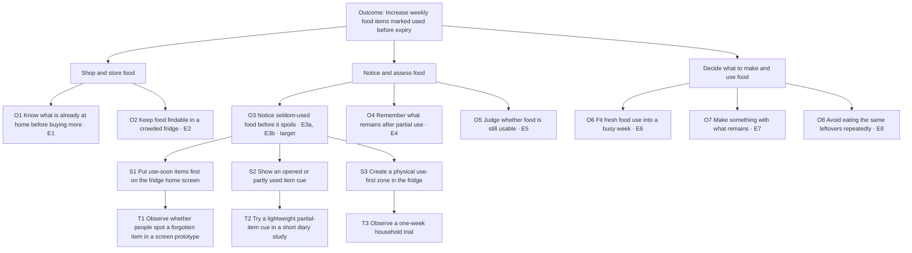

# Opportunity solution tree: Weekly Food Items Saved

## Outcome and evidence scope

**Working product outcome:** increase the number of fridge items app users log and then mark as used before expiry each week. This follows the North Star candidate in [Strategy/fridge-app-concept.md](Strategy/fridge-app-concept.md). Report items saved per weekly active user and the percentage of logged items saved alongside the total. A “used” mark is self-reported, so it is a proxy for food saved rather than proof that waste fell.

**Interview evidence:** the supplied *Audio file2.pdf* and [Strategy/interview-transcript.md](Strategy/interview-transcript.md) are two transcripts of the **same** recording, `University of Toronto - St. George Campus 3.m4a`. They represent **one group interview**, not two independent interviews. Exact quotes below follow the PDF, with its page, timestamp, and speaker label; the repository transcript was checked for the corresponding minute and context. The PDF's speaker labels are provisional, and the repository transcript warns that its automatic transcription has garbled passages. The audio has not been checked. This is a first-pass map of stories heard in one group, not a measure of how common these needs are among users.

## Tree

### Quote ledger

The quote is evidence for the **participant's experience**; each opportunity statement is our interpretation of that experience. `R` gives the matching minute block in the repository transcript and is a cross-check of the same recording, not another interview.

| Evidence | Opportunity and experience moment | Exact participant words from PDF | PDF locator; repo cross-check | Interpretation and limit |
|---|---|---|---|---|
| E1 | O1 · Shop | “you either think the cheese is done so let's buy more” | p. 4, 00:04:06, Speaker 2; R [04:00] | Buying again can follow from not seeing existing food. One cheese story. |
| E2 | O2 · Store | “It's difficult to kind of fit everything like on all of the shelves” | p. 2, 00:01:27, Speaker 2; R [01:00] | Space and layout are a real constraint; its effect on food waste remains unmeasured. |
| E3a | O3 · Notice | “it gets pushed to the back of the fridge where you don't often see it” | p. 4, 00:04:06, Speaker 2; R [04:00] | Cheese was forgotten out of sight and later discarded. |
| E3b | O3 · Notice | “So then for a good week and a half, we just forgot about it.” | p. 5, 00:05:08, Speaker 3; R [05:00] | Half a brick of cottage cheese was forgotten after the household routine changed; the speaker later says it had gone bad. |
| E4 | O4 · Assess | “how much is left when it should be consumed” | p. 5, 00:05:22, Speaker 3; R [05:00] | Partly used items create a quantity and timing problem. The transcript does not show that the participant wants to record every use in an app. |
| E5 | O5 · Assess | “this is smelling a certain way.” / “Is that good?” | p. 13, 00:12:57–00:13:00, Speaker 3; R [12:00–13:00] | A participant expresses uncertainty about freshness. Speaker attribution and wording warrant an audio check. |
| E6 | O6 · Use | “we don't really have time to cut up fruits” | p. 7, 00:07:21, Speaker 3; R [07:00] | Time to prepare fruit matters; that household later used forgotten apples in dessert. |
| E7 | O7 · Use | “whatever's there, let me make something with what remains rather than going to get more ingredients” | p. 8, 00:08:45, Speaker 2; R [08:00] | This is an existing preference and practice. It does not establish a need for recipe recommendations. |
| E8 | O8 · Use | “we also get sick and tired of looking at the same things that are left unconsumed.” | p. 10, 00:10:56, Speaker 3; R [10:00] | Repetition makes finishing remaining food less appealing. |

**Existing workaround:** Speaker 2 says food that will expire quickly is “sort of in your face” when the fridge opens (PDF p. 3, 00:03:14; R [03:00]). This supports the importance of visibility, but does not establish that an app screen will work as well as physical placement.

## Target path and solution tests

**Provisional target: O3, notice seldom-used food before it spoils.** The cheese and cottage-cheese stories describe actual spoilage, and the front-of-fridge workaround suggests a way visibility can help. E3a and E3b are different speakers in one group interview; they are not evidence of population prevalence. O4 and O6 also have concrete stories, while O7 describes something participants already do. There is no satisfaction, market, or comparative frequency data to rank these opportunities decisively.

| Candidate solution for O3 | Riskiest assumption | Smallest useful test |
|---|---|---|
| **S1. Put use-soon items first on the fridge home screen** | People will look at the app at a useful moment, and the inventory and expiry information will be current enough to reveal the item. | Show a small prototype using items from a participant's recent fridge story. Observe whether they find the forgotten item and choose an action, compared with an unsorted view; ask what information they would trust. |
| **S2. Cue opened or partly used items** | Marking an item as partly used is easy enough to do, and the cue helps people remember what remains. | Have a few participants record one or two opened items in a simple diary or paper mockup for several days. Observe recording effort and whether the cue changes recall or use. |
| **S3. Create a physical “use first” zone** | A visible shelf position is sufficient to prevent some items from being forgotten, even without an app. | Ask a willing household to try a labeled use-first area for one week. Record which items were put there, noticed, used, or still discarded; compare with their usual routine in a follow-up story. |

**One path to explore first:** O3 → S1 → T1. It directly addresses the out-of-sight story and can be tested without building receipt scanning or notifications. If the team later changes a fridge screen sketch, the single evidence-linked change is to make at-risk items visible first, with the freshness date presented as an estimate until date trust is studied. The tests above are proposed, not completed.

## Assumptions to keep separate

- `[assumption]` People are willing to log enough items, quantities, and dates for the app to show a reliable fridge. The interview mentions tracking what remains, but nobody describes willingness to enter each item or scan a receipt.
- `[assumption]` Push notifications will make people use food. The stories show forgotten items, not a stated preference for alerts.
- `[assumption]` Recipe recommendations are needed. Participants describe making meals from remaining ingredients already; E7 supports that goal, not difficulty inventing a meal.
- `[assumption]` Expiry dates alone can determine when food should be used. E5 and the discussion of smell and experience suggest that freshness judgments can be uncertain.

The prior tree selected logging effort as its target without interview evidence. It remains a necessary product assumption to test, while the current target follows a quoted customer story. Revisit this map after several more story-based interviews and an audio check of disputed passages.
